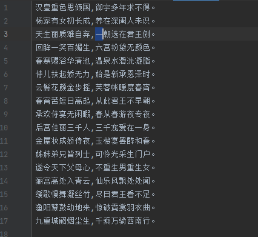

## 一、实验目的
掌握字符串String及其常用方法的使用

## 二、业务要求
&emsp;&emsp;恢复《长恨歌》诗词形式，加上标点符号，实现换行。

&emsp;&emsp;统计字或词出现的次数
## 三、实验要求
1. 每7个汉字加入一个标点符号，奇数时加“，”，偶数时加“。”；
2. 允许提供输入参数，统计古诗中某个字或词出现的次数。

## 四、实验过程
1. 将处理前的《长恨歌》放入TXT文本，读取文本，存入数组没七个字为一组。
2. 通过for循环对诗词添加“，”和“。”，奇数添加“，”，偶数添加“。”。
3. 将数组写入新的TXT文本。
4. 通过while循环对数组中的字或词进行检索，每检索到一次count增加1。


## 五、主要代码
1. 对诗词添加“，”和“。”，奇数添加“，”，偶数添加“。”
``` java
        try {
            in = new FileReader("B.txt");
            char[] chars = new char[7];
            for (int i = 1;in.read(chars) !=-1&&i<=34;i++){
                String str = new String(chars);
                if (i%2==1){
                    s.append(str+",");
                }else if (i%2==0){
                    s.append(str+"。"+"\n");
                }
}
```

2. 读取文本为空时，出现异常
``` java
         catch (IOException e) {
            e.printStackTrace();
        } finally {
            if (in != null) {
                try {
                    in.close();
                } catch (IOException e) {                 //空指针异常。in为空导致
                    e.printStackTrace();
                }
            }
        }
```

3. 向文件txt中写入处理好的文本
``` java
        FileWriter out = null;
        try {
            out = new FileWriter("A.txt");
           out.write(String.valueOf(s));
            out.flush();
        } catch (IOException e) {
            e.printStackTrace();
        } finally {
            if (out != null) {
                try {
                    out.close();
                } catch (IOException e) {
                    e.printStackTrace();
                }
            }
        }
```

6. 统计字词出现次数
``` java
        int i = 0;
        int count = 0;
        Scanner sc=new Scanner(System.in);
        String word=sc.next();
        while(s.indexOf(word,i)>=0){
            count++;
            i=s.indexOf(word,i)+word.length();
        }
        System.out.println(word+"出现次数为"+count+"次。");
}
```


## 六、运行截图
1.查询字词出现次数运行图

   

2.处理后的《长恨歌》

   

## 八、感想体悟
&emsp;&emsp;通过本次实验对异常处理有了更深的理解，掌握了String字符串一些其他用法，对于文本处理有了新的理解。
